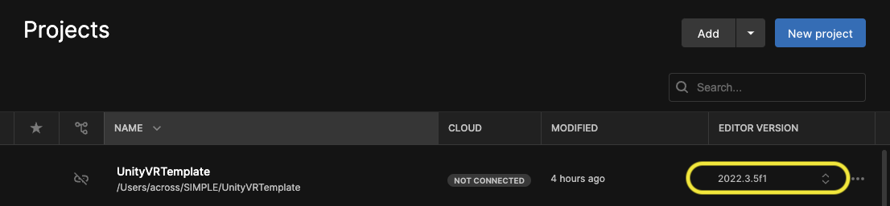
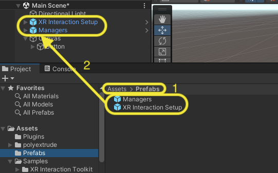
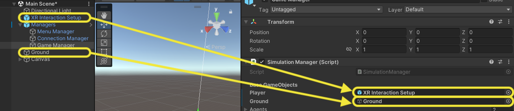
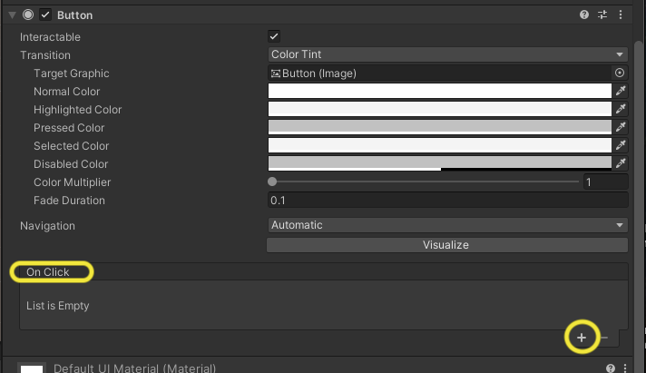
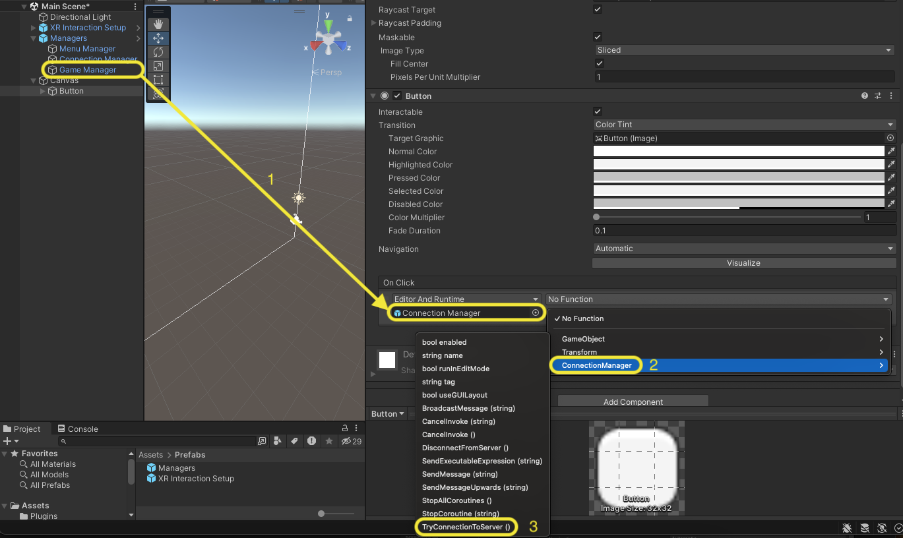
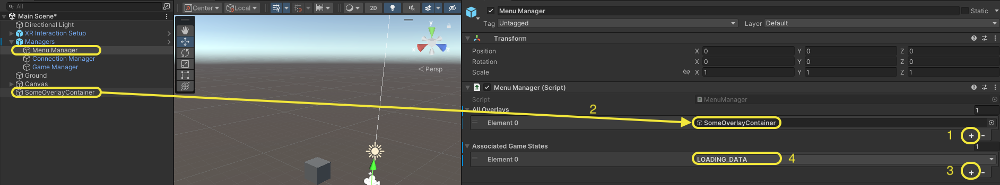

# GAMA VR Provider

This package allows to adapt a GAMA simulation to a VR environment created with Unity. It provides the VR developer with a game and connection management system, including GameObjects, methods and events that can be hooked. A list of these elements and how to use them is provided in the **Documentation** section.

## Installation

:warning: The package is being developped using **Unity Editor3.5f**. Although it should work with newer versions, as is doesn't use any version-specific features (for now), it is strongly recommanded to use exactly the same Editor version.  

### Prerequisites

Once the project is opened in Unity, if you have any errors, you can check the following points: 
- Make sure that Newtonsoft Json is installed. Normaly, cloning this repo should ensure that it is installed. But if it's not the case, follow the tutorial on this [link](https://github.com/applejag/Newtonsoft.Json-for-Unity/wiki/Install-official-via-UPM).
- Additionaly, make sure that the folder Assets/Plugins contains a .dll file called websocket-sharp. If not, download it from [this repo](https://github.com/sta/websocket-sharp). And place it in Assets/Plugins in your Unity project. 

To work properly, we assume that you already have a compatible GAMA model and tha you have installed the [Gama Server Middleware](https://github.com/project-SIMPLE/GamaServerMiddleware).

### What is included 

The project contains a basic scene with the required script and the following GameObjects:
- Directional Light
- XR Interaction Setup
- Managers
	- Menu Manager
	- Connection Manager
	- Game Manager

### Quick Start

1. Once the repository is cloned, import it as a Unity project. **Make sure to use the right Editor version (Unity Editor3.5f)**.

2. Drag and drop in the Scene the `Managers` and `XR Interaction Setup` from the `Prefabs` folder.  

3. In the GameObject `Managers/Game Manager`, drag and drop the GameObject `XR Interaction Setup` in the `Player` field of section `Base GameObjects`.
4. Create a 3D object in your scene (a cube for instance) and drag it into the field `Ground`  of section `Base GameObjects`.

5. Specify the IP address and the port of the middleware in the GameObject `Connection Manager`  (child of GameObject `Managers`).

6. Create in the scene an interactable component, for instance a Button. In the case of a Button, add an Item to the `OnClick` listener in the Inspector view.  
  
Then drag on drop in the `None (Object)` section the GameObject `Connection Manager`. Finally, in the dropdown menu, select `ConnectionManager > TryConnectionToServer()`  

7. Launch the middleware (refer to the dedicated documentation), GAMA and **make sure all the ports are correctly setup in the middleware**. Then launch the Unity App either Unity, or in the headset after having compiled it. By clicking on the button, the client (Unity app) should appear in the middleware monitor.

## Documentation

This section focuses only on the C# scripts which are useful for a Unity developer. The scripts not mentioned here are at least commented.  
**Important note:** As all the scripts which name finishes by "Manager" are instantiated when Unity is launched in the "Managers" GameObject, they are all (except MenuManager) developed using the Singleton Pattern. Hence trying to instantiate in some external scripts could break the default mechanisms. To call a method from one of these classes, one should rather use the following code snippet :
```csharp
NameOfClassManager.Instance.SomeMethod();
```

### WebSocketConnector

Base abstract class to establish a web-socket connection with GAMA. All the methods of this class are private or protected. Hence they are only accessible through a child class (ConnectionManager here).  
Theorically, in most cases, **one mustn't try to access the methods of this class**, as they are alreay used/overriden by ConnectionManager.

**Serialized Fields:**    
- `host` : ip address(/hostname) of the server
- `port`

**Abstract Methods:**  
- `HandleConnectionOpen` : triggered when a web-socket connection is established.
- `HandleReceivedMessage` : triggered when a message is received from the server.
- `HandleConnectionClosed` : triggered when the connection is closed, either by the server or by Unity itself.

### ConnectionManager

This class extends WebSocketConnector and implements the methods mentioned above. The corresponding script is already in a GameObject called "Connection Manager", which is already in the default scene.  
It is in charge of creating an ID for the player once the connection with GAMA is established. Moreover, it provides the Unity developer with a state machine implemented as an `enum` to handle each stage of the connection process. The specific role of each state is explined in the script source code. Some useful events allow the developer to to handle connection transitions and informations.

**Events:**  
- `OnConnectionStateChange<ConnectionState newState>` : Triggered when a transition from one connection state from another occurs.    
- `OnConnectiontStateReceived<JObject payload>` : Triggered when Unity receives a Json message from the server, which "type" field holds "json_state". For further informations about the payload detail, please refer to GamaServerMiddleware documentation
- `OnConnectionAttempted<boolean connectionSuccess>` : Triggered when a Json object with type "json_state" is received from the server, after Unity attempted to connect to it using `TryConnectionToServer` method. The boolean `connectionSuccess` contains true if the connection was successfully established, false otherwise.
- `OnServerMessageReceived` : Triggered when Unity receives a Json message from the server, which "type" field holds "json_simulation". For further informations about the payload detail, please refer to GamaServerMiddleware documentation.

**Methods:**
- `UpdateConnectionState(ConnectionState newState)` : Changes the current connection state to `newState`. Calling this method should be avoided whenever possible, as it could break the default connection process, leading to some undefined state.
- `TryConnectionToServer` : Attemps a connection to the middleware
- `IsConnectionState(ConnectionState currentState)` : Checks current state.
- `SendExecutableExpression(string expression)` : Allows to send an expression to GAMA through the middleware. **Beware** of the arguments expected by GAMA and special characters required by GAMA (such as `;`, `"`, ...) as the expression is executed as it is sent by Unity.
- `GetConnectionId` : Returns the ID created by Unity when the connection was established.

### MenuManager

As mentioned above this script is different from the other Managers as **it mustn't be instanciated at all** and it has no reason to be. It is only used to associate overlays with the GameStates during which they are displayed.  
How it works is decribed in the Tutorials section.

### SimulationManager

This is the core script of this package. It converts raw incoming json data into a set of functions and events to which the developer can hook up, in order to trigger some actions during the simulation.

**Events**:

- `OnGameStateChanged<GameState newGameState>` : Triggered when a transition from one GameState to another occurs.
- `OnGameRestarted` : Triggered when the function `RestartGame` is called.
- `OnGeometriesInitialized<GAMAGeometry geometries>` : Triggered when the initial geometries sent by GAMA are converted into polygons in the Unity scene. By default, `OnGameStateChanged` is triggered just after this event, to switch from the LOADING_DATA state to the GAME state. Hooking to this event allows to seperate the logic between the game state transition and the loading of geometries.  
:warning: This event is called when incoming geometric data is successfully managed and NOT when it is received.
- `OnWorldDataReceived<WorldJSONInfo worldData>` : Triggered each time the data of the running simulation is received and deserialized into a WorldJSONInfo object. In other word, for a regular GAMA simulation, Unity receives data from it at each (GAMA) timestep. 

**Methods**:

- `void UpdateGameState(GameState newState)` : Changes the current game state to `newState`. This method must be used with caution, as it could break the default game logic, leading to errors in the execution of crucial steps such as initialization or connection steps.
- `GameState GetCurrentState` : Returns the current game state
- `bool IsGameState(GameState state)` : Compares the current game state with the one specified as a parameter.
- `void RestartGame` : Restarts the game. Concretely, it reloads the main scene. This implementation is quite basic and can be enhanced with additional features by using the `OnGameRestarted` event.
- `Timer GetTimer` : Give access to the Timer script provided by this package.
- `void DisplayInfoText(string text)` : Allows to display a text to the user during the simulation. For instance it can be used for warning or error messages related to the connection or the game logic itself. The text is displayed in the infoText component which is accessible from the Unity editor.
- `void RemoveInfoText` : Hides info text from the screen.

## Tutorials

### Displaying a UI dor a given game state

Let's assume that you've created a fancy startup UI that you wish to display at the launch of your app. To do that, apply the following steps:
1. In the GameObject MenuManager (child of the GameObject Managers), expand `All Overlays` menu.  
Click on `+` button in the bottom right-hand corner of the menu to add a new item to the array  
2. From the Scene hierarchy, drag and drop the GameObject corresponding to your fancy UI
3. Expand `Associated Game States` menu.  
Click on `+` button in the bottom right-hand corner of the menu to add a new item to the array
4. Expand the list of game states to select the one during which you want to display your UI



### Calibrating the coordinate system between GAMA and Unity

In theory, the coordinate systems of GAMA and Unity are already aligned. However, for some reason (issues with the 3D elements added from external sources, redefinition of some parameters in GAMA) they may not match.  
In that case, you can apply some position and rotation transformations to the agents and change the `Coordinate conversion parameters` in the GameObject `Game Manager` (child of GameObject `Managers`).

### Hooking to a built-in event

If you want to trigger an action when an event occurs (OnGameStateChanged for instance), proceed as follows:
1. Subscribe to the event (here OnGameStateChanged) in the script in which you want to trigger the action:
```csharp
// #### Built-in Unity functions ####
void OnEnable() {
	SimulationManager.Instance.OnGameStateChanged += HandleGameStateChanged;
}

// Unsubscribing is essential to avoid memory leaks
void OnDisable() {
	SimulationManager.Instance.OnGameStateChanged -= HandleGameStateChanged;
}
```

2. Create the event handler function (i.e the function in which you define the actions to perform when the event is triggered):
```csharp
private void HandleGameStateChanged(GameState newState) {
	if (newState == GameManager.GAME) {
		// Do something
	} else {
		// Do something else
	}
}
```

:warning: For some reasons that are not yet explicable, if the actions defined within the event handler function are computationaly to heavy, then the handler function is not executed. Hence we propose a trick to overcome this issue :  


1. Create two local variables, one boolean that will act as a signal and one that will hold the new value of the parameter of the event handler when the event is fired:
```csharp
private GameState currentState;
private bool actionToPerformRequested;

// Built-in Unity function
void start() {
	currentState = SimulationManager.Instance.GetCurrentState();
	actionToPerformRequested = false;
}
```
2. Keep the same subscription mechanism as developed above.
3. Create the event handler and define the action in the Update loop:
```csharp
void Update() {
	if (actionToPerformRequested) {
		actionToPerformRequested = false;
		PerformAction();
	}
}

private void HandleGameStateChanged(GameState newState) {
	if (newState == GameManager.GAME) {
		actionToPerformRequested = true;
	}
}
```